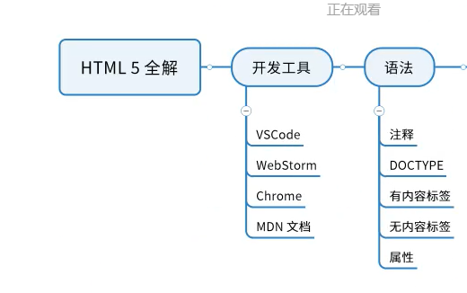
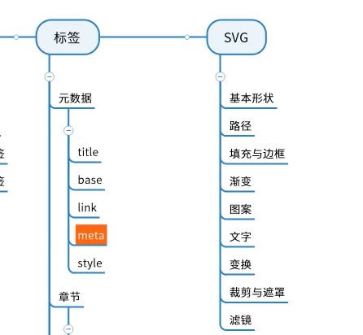
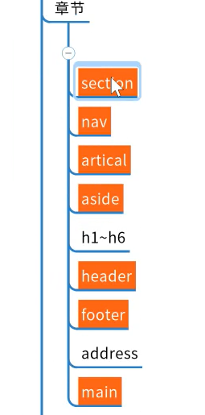
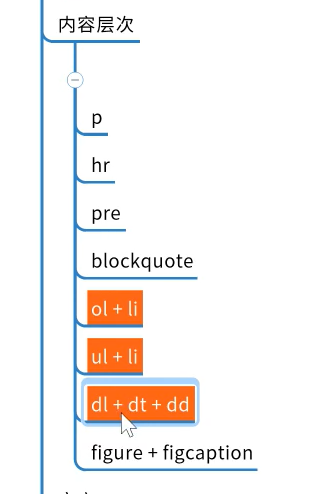
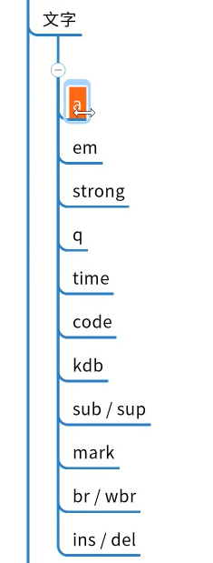
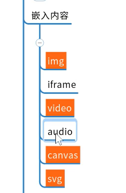
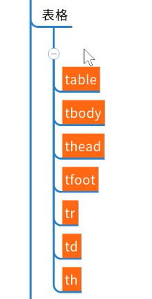
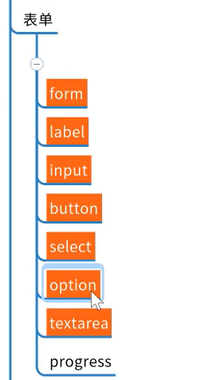
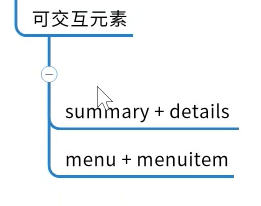

# [html5全解]   html概览

## www  就是万维网world wide 
www意思就是像世界那么大的网

# html语法

## 如何制作出网页

* 需要的知识

1. 域名知识 URL
2. http 服务器知识
3. html 知识
4. 其他

* 为什么没有css 和 js

1. 万维网初期就是没有 css 和 js
2. 1996年底 css 才发布第一个版本
3. 1995年底 javascript 才出现
4. 也就是说最开始的网页就是html在裸奔

# html

## html 常用标签：

1. h1~h6标签，表示标题
2. a 标签，表示页面跳转
3. div 标签，表示内容分块

## 橙色字的是必须要学的，没有橙色的选学

