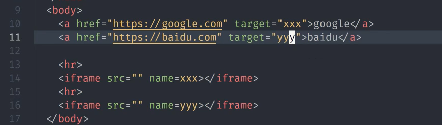

# [HTML全解] HTML重难点

## HTML 重点标签

### 英语小课堂

1. hyper 超级
2. target 目标
3. reference 引用
4. frame 边框、框架
5. error 错误
6. blank 空白
7. parent 父母之一
8. self 自己
9. load 加载
10. canvas 画布

## a 标签

### a 标签

* 属性

1. <pre>href      href=happy+ref 超级引用或者超链接
</pre>

2. target 要在哪一个窗口打开这个超链接
3. download
4. rel=noopener

* 作用

1. 跳转外部页面
2. 跳转内部锚点
3. 跳转到邮箱或电话等

### a的href的取值

* 网址

1. http://google.com
2. https://google.com
3. //google.com

* 路径

1. /a/b/c以及a/b/c
2. index.html 以及./index.html

* 伪协议

1. javascript:代码;
2. mailto:邮箱
3. tel:手机号

* id

1. href=#xxx

### a的target 的取值

* 内置名字

1. _blank 在新的页面打开
2. _top 在最顶层页面打开
3. _parent
4. _self 默认值，在当前页面打开

* 程序员命名

1. window的name
2. iframe的name



## table 标签

* 里面只能有三个标签

```html
<table>
        <thead>
            <tr>
                <th></th>
            </tr>
        </thead>
        <tbody>
            <tr>
                <td></td>
            </tr>
        </tbody>
        <tfoot></tfoot>
</table>
```

```html
 <tr></tr>    table里面的一行
 <th></th>    表示表头
 <td></td>    数据

 ```

 以下是示例：
# 1
```html
<table>
 <thead>
 <tr>
 <th>英语</th>
 <th>翻译</th>
 </tr>
 </thead>

<tbody>
<tr>
<td>hyper</td>
<td>超级</td>
</tr>

<tr>
<td>target</td>
<td>目标</td>
</tr>

<tr>
<td>reference</td>
<td>引用</td>
</tr>

<tr>
<td>frame</td>
<td>边框</td>
</tr>

<tr>
<td>error</td>
<td>错误</td>
</tr>

</tbody>

<tfoot>
<tr>
<td>空</td>
<td>空</td>
</tr>
</tfoot>
</table>
```

<table>
 <thead>
 <tr>
 <th>英语</th>
 <th>翻译</th>
 </tr>
 </thead>

<tbody>
<tr>
<td>hyper</td>
<td>超级</td>
</tr>

<tr>
<td>target</td>
<td>目标</td>
</tr>

<tr>
<td>reference</td>
<td>引用</td>
</tr>

<tr>
<td>frame</td>
<td>边框</td>
</tr>

<tr>
<td>error</td>
<td>错误</td>
</tr>

</tbody>

<tfoot>
<tr>
<td>空</td>
<td>空</td>
</tr>
</tfoot>
</table>

# 2
```html
<head>
<style>
    table{
        width: 200px;
        table-layout: fixed;
        border-collapse: collapse;
        border-spacing: 0px
    }
    td,
    th{
        border:1px solid red;
    }
</style>
</head>


<body>
<table>
        <thead>
            <tr>
                <th></th>
                <th>小红</th>
                <th>小明</th>
                <th>小颖</th>
            </tr>
        </thead>
        <table>
            <tr>
                <th>数学</th>
                <td>61</td>
                <td>91</td>
                <td>85</td>
            </tr>
            <tr>
                <th>语文</th>
                <td>79</td>
                <td>82</td>
                <td>92</td>
            </tr>
            <tr>
                <th>英语</th>
                <td>100</td>
                <td>97</td>
                <td>87</td>
            </tr>
        </table>
        </table>
    </table>
    </body>
```
<head>
<style>
    table{
        width: 200px;
        table-layout: fixed;
        border-collapse: collapse;
        border-spacing: 0px
    }
    td,
    th{
        border:1px solid red;
    }
</style>
</head>


<body>
<table>
        <thead>
            <tr>
                <th></th>
                <th>小红</th>
                <th>小明</th>
                <th>小颖</th>
            </tr>
        </thead>
        <table>
            <tr>
                <th>数学</th>
                <td>61</td>
                <td>91</td>
                <td>85</td>
            </tr>
            <tr>
                <th>语文</th>
                <td>79</td>
                <td>82</td>
                <td>92</td>
            </tr>
            <tr>
                <th>英语</th>
                <td>100</td>
                <td>97</td>
                <td>87</td>
            </tr>
        </table>
        </table>
    </table>
    </body>

### 样式
* border-spacing: px; 表格之间的间隙
* border-collapse: collapse;合并表格之间的空隙
* 上面实例有代码

## img标签

* 作用

1.发出get请求，展示一张图片

* 属性

1. alt 在你图片加载失败的时候加载一个字来提示用户
2. height 高度，只写高度宽度会自适应，两个都写会变形
3. width 宽度，只写宽度高度会自适应，两个都写会变形
4. src 就是图片的地址

* 事件

1. onload 加载成功
2. onerror 加载失败

* 响应式

1. max-width：100% 最大狂赌百分之一百

## form标签

* 作用

1. 发get或post请求，然后刷新页面

* 属性

1. action 里面写什么就会去哪个页面，用来控制哪个页面
2. autocomplete form上加上autocomplete在input=“”能给出自动的建议
3. method form上加上method用来控制用get还是post
4. target 把那个页面变成xxx

* 事件

1.onsubmit 当用户点提交时就会触发这个事件

* form里面一般会有输入框和提交按钮
```html
1. <input type="text"> 输入框
2. <input type="submit"> 提交按钮
```
* input与button的区别


```html
1. <button type="submit"><strong></strong></button>    input不能有其他的 button里面可以有其他标签比如<strong></strong>或 图片
2. <input type="submit" value=搞起> 可以把提交变成搞起
```
### input
```html
1. <input type="color"> 可以换颜色
2. <input type="radio">  男 可以选择性别，input后加上name="gender"可以单选男，女
3. <input type="password">  里面的输入框不显示具体的内容
4. <input type="checkbox"> 唱 <input type="checkbox"> 跳 可以多选，input后加上name="hobby" 可以告诉浏览器这是一组的
5. <input type="file"> 是上传文件的input， file后加上multiple ，可以上传多个文件
6. <input type="hidden"> 一般用于看不见的东西
```
```html
* <textarea></textarea>   可以写多行 以下是代码
```

```html
<textarea style="resize: none; width: 50%; height: 300px;"></textarea>
```
1. style="resize: none 的意思是使输入框不可放大缩小
2. width height 是确定宽度高度
```html
*   <select></select> 选择 以下是代码
```
```html
<select>
    <option value="">请选择</option>
    <option value="1">星期一</option>
    <option value="2">星期二</option>
</select>
```

1. value=""   双引号中间写值
2. 之后写内容