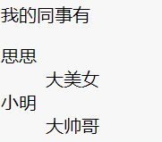

#   [html 全解] html 标签

## 英语小课堂

* heading  标题   
* body 身体、正文
* paragraph 段落
* section 一篇文章
* main 主要
* aside 旁边的
* anchor 锚、定点
* strong 强壮的、重要的
* emphasis 强调、重读
* order 顺序、秩序
* ordered 有顺序的
* unordered 无顺序的
* description 描述
* term 术语
* data 数据
* quote 引用
* block 块
* inline 行内、[计]内联
* break 打断


## 学习工具

[网上的vscode 代码沙盒](https://codesandbox.io/)


## html 起手式


### 章节标签

* 表示文章/书的层级

1. 标题 h1~h6
2. 章节 section
3. 文章 article
4. 段落 p
5. 头部 header
6. 脚部 footer
7. 主要内容 main
8. 旁支内容 aside
9. 划分 div


### 全局属性

*   所有标签都有属性

1. class 给你的标签分一个类(标记)
```html
<head>
<style>
    .middle {
      background: black;
      color: white;
    }
    .bordered{
      border: 5px solid red;
    }
  </style>
  </head>

<div class="middle bordered">
```
2. contenteditable 可以是任何一个元素能被编辑
```html
<div class="middle bordered" contenteditable>
```    

3. hidden 快速让一个东西看不见
```html
<h1 hidden>文章标题</h1>
```
4. id
5. style  下列用法
```html
<p style="color:red"></p>
 <header id="xxx" style="border: 10px solid green;">顶部广告</header>
```   
6. tabindex 用来控制table的顺序 
;正数表示顺序访问 ;0表示最后访问 ;-1表示不要访问我。
```html
<h1 tabindex=1>文章标题</h1>
<h2 tabindex=2>第一章</h2>
  <P tabindex=3>这是一段话</p>
  ```

7. title

## 默认样式& CSS reset

1. 为什么会有默认样式

* 因为HTML被发明的时候，CSS还没出生

2. 怎么看默认样式

* Chrome开发者工具
* Elements -> Styles -> user agent stylesheet

### table
```html
          <style>
          td{border: 1px solid red}
          </style>
          <table>
            <tr>
              <td>1</td>
              <td>2</td>
            </tr>
            <tr>
              <td>3</td>
              <td>4</td>
            </tr>
          </table>
```


* 要加以下内容
```css
table {
  border-collapse: collapse;
  border-spacing: 0
}
```


## 常见的内容标签

### 内容标签

* ol+li

<ol>
<li>
ol: ordered list 有顺序的列表
</li>
    <li>
    li : list item 列表中的一项
    </li>
    <li>
    ol里面只能有li,不能含有除了li之外的所有子元素
    </li>
</ol>

```html
<ol>
    <li></li>
</ol>
```
* ul+li

   没有顺序的列表 unordered list

```html
<ul>
    <li></li>
</ul>
```
* dl+dt+dd

1. dl description list 描述列表，表述一个东西的
2. dt里面写的是描述的谁
3. dd里面写的是描述的内容

```html
<dl>
    <dt></dt>
    <dd></dd>
</dl>
```
效果图：




* pre

  如果你想保留回车、空格、内容就用pre标签
* hr

  加分割线的，划分之前和之后

* br

  换行、中断、打断这一行


* a

  用来抄链接的

* em

  用来强调(语气的强调)
* strong

  用来表示重要的(本身的强调，很重要)
* code

  字体是等宽的

* quote

  引用
* blockquote

  换行的引用